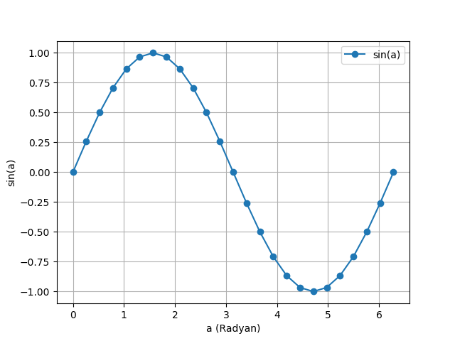

# The Fundamentals of Autograd  
## Autograd (Otomatik Türev)

PyTorch'un *Autograd* özelliği, PyTorch'u esnek ve hızlı hale getiren önemli bir bileşendir. Bu özellik, karmaşık hesaplamalar üzerinde birden çok kısmi türevin (aynı zamanda *gradyanlar* olarak da adlandırılır) hızlı ve kolay bir şekilde hesaplanmasını sağlar. Bu işlem, geri yayılım (backpropagation) tabanlı sinir ağı öğrenmesinin temelidir.

Autograd'ın gücü, hesaplamalarınızı *çalışma zamanında* dinamik olarak izlemesinden gelir. Bu, modelinizde karar dalları veya çalışma zamanında belirlenen uzunluklara sahip döngüler olsa bile hesaplamanın doğru bir şekilde izleneceği ve öğrenmeyi yönlendirecek doğru gradyanların elde edileceği anlamına gelir. Ayrıca modellerinizin Python içinde oluşturulması, gradyan hesaplamaları için daha katı bir şekilde yapılandırılmış modellerin statik analizine dayanan çerçevelere kıyasla çok daha fazla esneklik sunar.

## Autograd'a Neden İhtiyacımız Var?

Bir makine öğrenimi modeli, girdileri ve çıktıları olan bir *fonksiyondur*. Bu bağlamda, girdileri *i*-boyutlu bir vektör $\vec{x}$ olarak ele alacağız ve elemanlarını $x_{i}$ ile göstereceğiz. Böylece modeli, *M*, girdinin vektör değerli bir fonksiyonu olarak ifade edebiliriz: $\vec{y} = \vec{M}(\vec{x})$. (Burada modelin çıktı değerini bir vektör olarak ele alıyoruz çünkü genel olarak bir modelin herhangi bir sayıda çıktısı olabilir.)

Autograd'ı genellikle model eğitimi bağlamında ele alacağımız için, ilgilendiğimiz çıktı modelin kaybı olacaktır. *Kayıp fonksiyonu* L($\vec{y}$) = L($\vec {M}$($\vec{x}$)) modelin çıktısının tek değerli (skaler) bir fonksiyonudur. Bu fonksiyon, modelimizin tahmininin belirli bir girdiye ait *ideal* çıktısından ne kadar uzak olduğunu gösterir. Not: Bundan sonra, bağlama göre açık olduğu durumlarda vektör işaretini kaldıracağız - örneğin, $\vec{y}$ yerine $y$ kullanacağız.

Modeli eğitirken, kaybı en aza indirmek isteriz. İdeal durumda, modelin öğrenme ağırlıklarını (fonksiyonun ayarlanabilir parametreleri) tüm girdiler için kaybın sıfır olacak şekilde ayarlamak gerekir. Gerçek dünyada ise bu, öğrenme ağırlıklarını küçük adımlarla ayarlayarak çeşitli girdiler için kabul edilebilir bir kayıp seviyesine ulaşmak anlamına gelir.

Peki, ağırlıkları hangi yönde ve ne kadar değiştireceğimizi nasıl belirleriz? Kaybı *en aza indirmek* istiyoruz, yani kaybın girdiye göre birinci türevini sıfıra eşitlemek gerekir: $\frac{\partial L}{\partial x} = 0$.

Ancak unutmayalım ki kayıp doğrudan girdiden türetilmemektedir, aksine modelin çıktısının bir fonksiyonudur (ki bu da girdinin doğrudan bir fonksiyonudur): $\frac{\partial L}{\partial x}$ = $\frac{\partial {L({\vec y})}}{\partial x}$. Türevlerin zincir kuralına göre şu ifadeyi elde ederiz:

\[
    $\frac{\partial {L({\vec y})}}{\partial x}$ = $\frac{\partial L}{\partial y}$ $\cdot$ $\frac{\partial y}{\partial x}$ = $\frac{\partial L}{\partial y}$ $\cdot$ $\frac{\partial M(x)}{\partial x}$
\]

Burada $\frac{\partial M(x)}{\partial x}$ ifadesi karmaşıklaşır. Modelin çıktılarının girdilere göre kısmi türevleri, zincir kuralı tekrar kullanıldığında, her bir çarpılan öğrenme ağırlığı, aktivasyon fonksiyonu ve modeldeki diğer tüm matematiksel dönüşümler üzerindeki yerel kısmi türevleri içeren uzun ifadeler oluşturacaktır. Her bir kısmi türev için tam ifade, hesaplama grafiği boyunca *tüm olası yolların* yerel gradyanlarının çarpımlarının toplamıdır.

Özellikle, öğrenme ağırlıkları üzerindeki gradyanlar bizim için önemlidir; çünkü bunlar bize *hangi ağırlığın hangi yönde değişmesi gerektiğini* gösterir ve böylece kayıp fonksiyonunu sıfıra yaklaştırabiliriz.

Nöral ağ derinliği arttıkça, bu tür yerel türevlerin sayısı (ve her biri modelin hesaplama grafiği içindeki farklı bir yol ile ilişkilidir) üstel olarak artacaktır, dolayısıyla bunları hesaplama karmaşıklığı da artar. İşte burada autograd devreye girer: Her hesaplamanın geçmişini takip eder. PyTorch modelinizde hesaplanan her tensör, giriş tensörlerinin geçmişini ve onu oluşturmak için kullanılan fonksiyonu taşır. Ayrıca PyTorch'taki tensörlere yönelik fonksiyonlar, kendi türevlerini hesaplamak için yerleşik bir uygulamaya sahip olduğundan, öğrenme için gerekli olan yerel türevlerin hesaplanmasını büyük ölçüde hızlandırır.

## Basit Bir Örnek

Bu, oldukça fazla teorik bilgi içeriyordu. Peki, autograd'ı pratikte nasıl kullanırız?

Öncelikle, sonuçlarımızı grafikle gösterebilmek için bazı kütüphaneleri içe aktararak başlayalım:

```python
import torch
import matplotlib.pyplot as plt
import matplotlib.ticker as ticker
import math
```
Şimdi, $[0, 2{\pi}]$ aralığında eşit aralıklı değerlerle dolu bir giriş tensörü oluşturacağız ve `requires_grad=True` belirteceğiz. (Çoğu tensör oluşturma fonksiyonunda olduğu gibi, `torch.linspace()` de isteğe bağlı olarak `requires_grad` parametresini kabul eder.)  Bu bayrağı(flag) (`requires_grad=True`) ayarlamak şu anlama gelir:  

Bu tensör kullanılarak yapılan her hesaplamada, autograd işlem geçmişini çıktı tensörlerinde biriktirecektir. Yani, PyTorch'un autograd hesaplama mekanizması devreye girerek, tensör üzerinde yapılan tüm işlemleri kaydedecek ve geri yayılım (backpropagation) sırasında bu bilgileri kullanacaktır.


#### Kod:
```python
a = torch.linspace(0, 2 * math.pi, steps=25, requires_grad=True) 
print(a)
```
#### Çıktı:
```plaintext
tensor([0.0000, 0.2618, 0.5236, 0.7854, 1.0472, 1.3090, 1.5708, 1.8326, 2.0944,
        2.3562, 2.6180, 2.8798, 3.1416, 3.4034, 3.6652, 3.9270, 4.1888, 4.4506,
        4.7124, 4.9742, 5.2360, 5.4978, 5.7596, 6.0214, 6.2832],
       requires_grad=True)
```
Şimdi, bir hesaplama gerçekleştireceğiz ve çıktısını girdilere göre grafiğe dökeceğiz.
#### Kod:
```python
b = torch.sin(a)
plt.plot(a.detach(), b.detach(), marker='o', linestyle='-')
plt.xlabel("a (Radyan)")
plt.ylabel("sin(a)")
plt.grid()
plt.show()
```
#### Çıktı:



